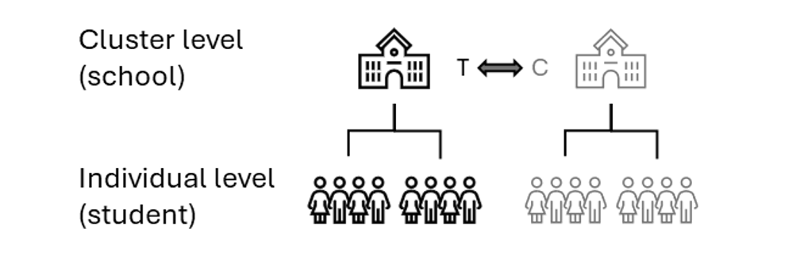

::: {.callout-tip title="How to use this document"}
This page contains the code from the handbook chapter with the explanatory text removed. Run the chunks in order from the top, because later chunks depend on objects created earlier. The numbered notes under a chunk explain the marked lines. The full discussion of each stage is in the handbook chapter.
:::
::: {.callout-important title="In the workshop"}
We run this page after the Chapter 5 page. Every chunk here runs in a few seconds, so run the page from top to bottom without skipping anything. The page loads its own packages and data and does not depend on Chapter 5, so you can run it in a fresh session.
:::

```{r}
#| label: setup
#| message: false
#| warning: false

# ── Packages ──────────────────────────────────────────────────────────────────
library(tidyverse)
library(MatchIt)
library(matchMulti)
library(cobalt)
library(lme4)
library(marginaleffects)
library(sensemakr)
library(performance)
library(gt)

# ── AIR brand palette ─────────────────────────────────────────────────────────
air_navy   <- "#00507F"
air_blue   <- "#009DD7"
air_mid    <- "#006E9F"
air_green  <- "#08A94F"
air_gray   <- "#E2E6E8"
air_dark   <- "#1C252D"

# Default ggplot2 theme
theme_set(
  theme_minimal(base_size = 12) +
    theme(
      plot.title = element_text(color = air_navy, face = "bold"),
      panel.grid.minor = element_blank()
    )
)

set.cobalt.options(binary = "std")

# ── Data ──────────────────────────────────────────────────────────────────────
# Loads the TIMSS analytic data. cluster_treatment is constructed in Chapter 4
# and is constant within schools (every student in a school shares one value),
# so we do not recompute it here.
timss <- readRDS("data/timss_df.rds")
```

::: {.callout-note title="Main takeaways"}
- A **cluster assignment design (CAD)** is one in which whole clusters (schools) select or are placed into the treatment condition. Every individual (student) in a cluster shares the same treatment status, and the outcome is measured at the individual level.
- CAD can target either the **cluster-average effect** (each cluster weighted equally) or the **individual-average effect** (each individual weighted equally).
- The choice among matching approaches (cluster-level global, sequential, network-flow optimization) sets the level at which matching operates and the degree of control for cluster-level versus individual-level confounding.
- Balance should be checked at two levels. Because matching operates on clusters while outcomes are defined by individuals, equal cluster-level covariate means can still mask divergent within-cluster distributions.
:::

```{r}
#| label: fig-cad-design
#| fig-cap: "Structure of a cluster assignment design. Whole clusters (schools) are assigned to treatment (T) or comparison (C); every individual in a cluster shares the cluster's condition."
#| out-width: "55%"
#| fig-align: center


```

## Stage 1: Define estimand and understand data {#sec-cad-stage1}

The estimand in this example is the effect on the treated schools. Stage 5 estimates the individual-average, the cluster-average, and a precision-weighted version of it.

### Examining the data context

```{r}
#| message: false
#| warning: false
#| label: tbl-cad-cluster-sizes
#| tbl-cap: "Cluster-size distribution by treatment status."
#| code-line-numbers: true

cluster_diagnostics <- timss |>
  summarise(
    cluster_treatment = first(cluster_treatment),                 # <1>
    n_students = n(),
    .by = school_id
  ) |>
  arrange(school_id)

cluster_diagnostics |>
  summarise(
    mean_size = mean(n_students),                                 # <2>
    sd_size   = sd(n_students),
    min_size  = min(n_students),
    max_size  = max(n_students),
    .by = cluster_treatment
  ) |>
  arrange(cluster_treatment) |>
  mutate(cluster_treatment = if_else(cluster_treatment == 1,
                                     "Treated", "Comparison")) |>
  gt() |>
  cols_label(cluster_treatment = "Group", mean_size = "Mean size",
             sd_size = "SD", min_size = "Min", max_size = "Max") |>
  fmt_number(columns = c(mean_size, sd_size), decimals = 1)
```

1. `first(cluster_treatment)` is safe here because the indicator is constant within a school, so the summary collapses to one row per school (Diagnostic 1). We attach each school's student count for Diagnostic 2.
2. The by-group size summaries (mean, SD, min, max of students per school) quantify how much cluster sizes vary, which is the practical input to the cluster-average versus individual-average choice.

```{r}
#| message: false
#| warning: false
#| fig-height: 3.5
#| fig-width: 7
#| label: fig-cad-cluster-sizes
#| fig-cap: "Distribution of cluster (school) sizes by treatment status. Wide variation in cluster size makes the choice between the cluster-average and individual-average effects more consequential."
#| code-line-numbers: true

cluster_diagnostics |>
  mutate(group = if_else(cluster_treatment == 1,
                         "Treated", "Comparison")) |>
  ggplot(aes(x = n_students, fill = group)) +                     # <1>
  geom_histogram(bins = 15, alpha = 0.8, position = "identity") + # <2>
  scale_fill_manual(values = c(air_navy, air_blue)) +
  labs(x = "Students per school", y = "Number of schools", fill = NULL)
```

1. We bin schools by their student count, colored by treatment status, to show the cluster-size spread within each group.
2. `position = "identity"` overlays the two groups so their size distributions can be compared directly.

```{r}

icc_outcome <- performance::icc(
  lmer(math_score ~ 1 + (1 | school_id), data = timss))$ICC_adjusted
icc_conf <- performance::icc(
  lmer(student_math_conf ~ 1 + (1 | school_id), data = timss))$ICC_adjusted

c(icc_outcome = icc_outcome, icc_math_conf = icc_conf)
```

## Stage 2: Define distance measure {#sec-cad-stage2}

### Covariates and aggregation to the cluster level

```{r}
#| message: false
#| warning: false
#| code-line-numbers: true

cluster_df <- timss |>
  summarise(
    cluster_treatment = first(cluster_treatment),                 # <1>
    school_locale     = first(school_locale),                     # <2>
    school_pop        = first(school_pop),
    school_econ_pct   = first(school_econ_pct),
    school_discipline = first(school_discipline),
    mean_math_conf    = mean(student_math_conf),                  # <3>
    mean_like_math    = mean(student_like_math),
    mean_age          = mean(student_age),
    mean_dad_edu      = mean(dad_edu),
    .by = school_id
  ) |>
  arrange(school_id)

cluster_df
```

1. `first(cluster_treatment)` retains the school's (constant) treatment status.
2. The school-level covariates on this and the following lines are constant within a school, so `first()` retains each school's single value.
3. Individual covariates are aggregated to school means. Adding the SD or a quantile of each (not shown) would retain within-school distributional information at the cost of more parameters in the model.

### Estimating the cluster-level propensity score

```{r}
#| message: false
#| warning: false
#| code-line-numbers: true

ps_cluster_formula <- cluster_treatment ~                         # <1>
  school_locale + school_pop + school_econ_pct +
  school_discipline + mean_math_conf + mean_like_math +
  mean_age + mean_dad_edu

m_ps_cluster <- matchit(ps_cluster_formula,                       # <2>
                        data = cluster_df,
                        method = NULL, distance = "logit")

cluster_df <- cluster_df |>
  mutate(pscore = m_ps_cluster$distance)                          # <3>

summary(cluster_df$pscore)
```

1. The left-hand side is `cluster_treatment`. The right-hand side includes cluster covariates with the aggregated individual means.
2. `matchit(..., method = NULL, distance = "logit")` fits the logistic propensity score model without performing any matching, the same idiom as Stage 2 of Chapter 5.
3. `matchit()` stores the fitted probabilities, on the [0, 1] scale, in the `distance` element. We store one propensity score per school in `cluster_df`.

### Checking common support {#sec-cad-stage2-overlap}

```{r}
#| message: false
#| warning: false
#| fig-height: 3.5
#| fig-width: 7
#| label: fig-cad-overlap
#| fig-cap: "Common support for the cluster-level propensity score."
#| fig-subcap:
#|   - "Density of the cluster propensity score by treatment status."
#|   - "One jittered point per school, the more legible view at small cluster counts."
#| layout-nrow: 2
#| code-line-numbers: true

bal.plot(m_ps_cluster,                                           # <1>
         var.name = "distance",
         which = "unadjusted",
         sample.names = "Full sample",
         colors = c(air_navy, air_blue)) +
  scale_fill_manual(values = c(air_navy, air_blue),
                    labels = c("Comparison", "Treated")) +
  labs(x = "Cluster propensity score", fill = "Group") +
  ggtitle("Cluster propensity score density")

overlap_df <- cluster_df |>                                      # <2>
  mutate(group = if_else(cluster_treatment == 1,
                         "Treated", "Comparison"))

ggplot(overlap_df, aes(x = pscore, y = group, color = group)) +  # <3>
  geom_jitter(height = 0.15, width = 0, size = 2.5, alpha = 0.8) +
  scale_color_manual(values = c(air_navy, air_blue)) +
  labs(x = "Cluster propensity score", y = NULL) +
  theme(legend.position = "none") +
  ggtitle("Cluster propensity score by school (jittered)")
```

1. `bal.plot()` (from `cobalt`, as in the overlap check in Chapter 5) accepts the Stage 2 `matchit` object directly. `var.name = "distance"` plots the cluster propensity score, and `which = "unadjusted"` plots the pre-matching distributions.
2. We label each school by treatment status on the aggregated frame, which holds one row per school and the stored cluster propensity score.
3. The dot plot places one point per school on the propensity score axis. The points are jittered along the y-axis to facilitate visual inspection.

## Stage 3: Implement matching method {#sec-cad-stage3}

### Cluster-level global matching

```{r}
#| message: false
#| warning: false
#| code-line-numbers: true

m_cluster_nn <- matchit(
  ps_cluster_formula,                                             # <1>
  data     = cluster_df,
  method   = "nearest",                                           # <2>
  distance = cluster_df$pscore,                                   # <3>
  replace  = FALSE,                                               # <4>
  estimand = "ATT"                                                # <5>
)

m_cluster_nn
```

1. The formula keeps the cluster covariates in the object so they appear in later balance plots. The propensity score itself is supplied separately, as in Chapter 5.
2. `method = "nearest"` requests 1:1 nearest-neighbor matching on schools.
3. `distance = cluster_df$pscore` passes the cluster propensity score computed in Stage 2 rather than refitting it inside `matchit()`.
4. `replace = FALSE` matches without replacement, so each comparison school is the match for at most one treated school.
5. `estimand = "ATT"` targets the effect on the treated schools, so a comparison school is selected for each treated school.

```{r}
#| message: false
#| warning: false
#| code-line-numbers: true

m_cluster_opt <- matchit(
  ps_cluster_formula,
  data     = cluster_df,
  method   = "optimal",                                           # <1>
  distance = cluster_df$pscore,
  estimand = "ATT"
)

m_cluster_opt
```

1. `method = "optimal"` minimizes the total within-pair distance across all `r length(unique(timss$school_id[timss$cluster_treatment == 1]))` treated schools at once (via the `optmatch` backend), often improving balance over the greedy nearest-neighbor solution when the treated pool is small. All other arguments are identical to the nearest-neighbor call, except that `replace` is dropped because optimal matching does not use it.

### Sequential matching

```{r}
#| message: false
#| warning: false
#| code-line-numbers: true

set.seed(20250326)                                                # <1>

dat_sequential <- timss |>
  inner_join(match.data(m_cluster_nn) |>                          # <2>
               select(school_id, cluster_pair = subclass),
             by = "school_id") |>
  group_split(cluster_pair) |>                                    # <3>
  map(\(pair_df) {
    matchit(
      cluster_treatment ~ student_math_conf + student_age +
        student_like_math + student_sex + dad_edu,                # <4>
      data     = pair_df,
      method   = "nearest",
      distance = "glm",
      replace  = FALSE
    ) |>
      match.data()
  }) |>
  list_rbind()                                                    # <5>

count(dat_sequential, cluster_treatment)
```

1. Ties can be broken at random, so we set a seed to keep the results reproducible across renders.
2. Step 1 reuses the cluster-global nearest-neighbor solution. `match.data()` returns the matched schools with a `subclass` column identifying each cluster pair, which we rename to `cluster_pair` so it does not collide with the student-level match below. The join keeps only students in matched schools and attaches their cluster-pair id.
3. `group_split(cluster_pair)` splits the students into one data frame per matched school pair. Every pair contains one treated and one comparison school by construction.
4. Within each pair, we match students 1:1 without replacement on a student-level logistic propensity score built from individual covariates only. School context is already held fixed by the pairing, so only individual covariates remain.
5. `match.data()` returns the matched students for each pair, and `list_rbind()` stacks them into one analysis frame, `dat_sequential`, carrying `weights`, the cluster-pair id, and a within-pair `subclass` from the student-level match.

### Network-flow optimization matching

```{r}
#| message: false
#| warning: false
#| code-line-numbers: true

set.seed(20250326)                                                # <1>

timss_df <- as.data.frame(timss)                                  # <2>

m_multi <- matchMulti(
  data           = timss_df,
  treatment      = "cluster_treatment",                           # <3>
  school.id      = "school_id",
  match.students = TRUE,                                          # <4>
  student.vars   = c("student_math_conf", "student_age",         # <5>
                     "student_like_math", "student_sex", "dad_edu"),
  school.fb      = list(c("school_locale"),                       # <6>
                        c("school_locale", "school_pop"))
)

c(schools = n_distinct(m_multi$matched$school_id),
  students = nrow(m_multi$matched))
```

1. As above, we set a seed because ties can be broken at random.
2. `matchMulti()` errors on tibble input, so we convert to a plain `data.frame`.
3. `treatment` and `school.id` name the cluster-level treatment variable and the cluster identifier. The algorithm matches schools, not students directly.
4. `match.students = TRUE` matches individuals within each chosen school pair as part of the optimization, rather than carrying all students forward. Set it to `FALSE` to include every student in a matched school, as cluster-global does.
5. `student.vars` lists the individual covariates used to score within-pair balance. These determine the individual-level component of the composite distance.
6. `school.fb` requests **fine balance** on school-level covariates. Fine balance preserves the marginal distribution of each listed variable across treated and comparison schools without requiring exact matches. The matched comparison schools then collectively reproduce the treated schools' urban/suburban/rural mix even when no individual pair matches exactly on locale. Listing covariates in nested groups (here locale alone, then locale with community size) sets their priority, with higher-priority constraints satisfied first.

## Stage 4: Assess quality of the matched sample {#sec-cad-stage4}

### Sample retention

```{r}
#| message: false
#| warning: false
#| label: tbl-cad-retention
#| tbl-cap: "Treated-cluster and treated-student retention by matching approach."
#| code-line-numbers: true

n_treated_clusters <- length(unique(
  timss$school_id[timss$cluster_treatment == 1]))                 # <1>
n_treated_students <- sum(timss$cluster_treatment == 1)

dat_cluster_nn <- match.data(m_cluster_nn)                        # <2>
ind_cluster_nn <- timss |>
  inner_join(dat_cluster_nn |> select(school_id, weights, subclass),
             by = "school_id")

matched_samples <- list(                                          # <3>
  "Cluster-global (NN)"       = ind_cluster_nn,
  "Sequential"                = dat_sequential,
  "Network flow (matchMulti)" = m_multi$matched
)

retention <- matched_samples |>
  imap(\(d, nm) {
    treated <- filter(d, cluster_treatment == 1)                  # <4>
    tibble(approach          = nm,
           clusters_retained = n_distinct(treated$school_id),
           students_retained = nrow(treated))
  }) |>
  list_rbind() |>
  mutate(pct_clusters = 100 * clusters_retained / n_treated_clusters,
         pct_students = 100 * students_retained / n_treated_students)

retention |>
  gt() |>
  cols_label(approach = "Matching approach",
             clusters_retained = "Treated clusters", students_retained = "Treated students",
             pct_clusters = "% clusters retained", pct_students = "% students retained") |>
  fmt_number(columns = c(pct_clusters, pct_students), decimals = 1)
```

1. We record the totals before matching: treated clusters and treated students.
2. For the cluster-global match, `match.data()` returns matched schools. Joining back to `timss` expands to the students in those schools, carrying matching `weights`.
3. A named list of the three matched student samples, mirroring the retention pattern in Chapter 5. The `matchMulti` object stores its matched individual-level data in `$matched`.
4. For each sample, we filter to treated rows and count distinct schools and students. `list_rbind()` stacks the three rows into the retention table.

```{r}
# Per-school retention of treated students in the network-flow sample
nf_school_ret <- timss |>
  filter(cluster_treatment == 1) |>
  count(school_id, name = "n_total") |>
  left_join(matched_samples[["Network flow (matchMulti)"]] |>
              filter(cluster_treatment == 1) |>
              count(school_id, name = "n_kept"),
            by = "school_id") |>
  mutate(n_kept = coalesce(n_kept, 0L), pct = 100 * n_kept / n_total)

summary(nf_school_ret$pct)
```

### Cluster covariate balance (SMD & variance ratio) {#sec-cad-stage4-cluster}

```{r}
var_labels <- c(
  distance          = "Propensity score",
  school_locale     = "School locale",
  school_pop        = "Community population",
  school_econ_pct   = "Economically disadvantaged %",
  school_discipline = "Discipline/climate index",
  mean_math_conf    = "Mean math confidence",
  mean_like_math    = "Mean liking math",
  mean_age          = "Mean age",
  mean_dad_edu      = "Mean father's education",
  student_sex       = "Sex",
  student_age       = "Age",
  student_math_conf = "Math confidence",
  student_like_math = "Liking math",
  dad_edu           = "Father's education",
  mom_edu           = "Mother's education",
  sd_math_conf      = "SD of math confidence",
  sd_like_math      = "SD of liking math",
  sd_age            = "SD of age"
)
```

::: panel-tabset

#### Nearest-neighbor

```{r}
#| message: false
#| warning: false
#| fig-height: 4.5
#| fig-width: 8
#| label: fig-cad-cluster-balance
#| fig-cap: "Cluster-level balance for the nearest-neighbor cluster match: standardized mean differences (left) and variance ratios (right), before and after matching."

love.plot(m_cluster_nn,
          stats = c("mean.diffs", "variance.ratios"),
          thresholds = c(m = .25, v = 2),
          sample.names = c("Full sample", "Matched sample"),
          var.names = var_labels,
          colors = c(air_navy, air_blue),
          title = "Cluster-level balance (NN)")
```

#### Optimal

```{r}
#| message: false
#| warning: false
#| fig-height: 4.5
#| fig-width: 8
#| label: fig-cad-cluster-balance-opt
#| fig-cap: "Cluster-level balance for the optimal cluster match: standardized mean differences (left) and variance ratios (right), before and after matching."

love.plot(m_cluster_opt,
          stats = c("mean.diffs", "variance.ratios"),
          thresholds = c(m = .25, v = 2),
          sample.names = c("Full sample", "Matched sample"),
          var.names = var_labels,
          colors = c(air_navy, air_blue),
          title = "Cluster-level balance (optimal)")
```

:::

```{r}

dat_cluster_opt <- match.data(m_cluster_opt)

cluster_matched <- list(nn = dat_cluster_nn, opt = dat_cluster_opt)

max_smd <- cluster_matched |>
  map(\(d) bal.tab(ps_cluster_formula, data = d,
                    weights = d$weights, s.d.denom = "treated")) |>
  map_dbl(\(b) max(abs(b$Balance$Diff.Adj), na.rm = TRUE))

max_smd
```

```{r}
#| message: false
#| warning: false
#| code-line-numbers: true

hetero_df <- timss |>
  summarise(
    sd_math_conf = sd(student_math_conf),                         # <1>
    sd_like_math = sd(student_like_math),
    sd_age       = sd(student_age),
    .by = school_id
  )

het_bal <- bal.tab(
  cluster_treatment ~ sd_math_conf + sd_like_math + sd_age,       # <2>
  data    = dat_cluster_nn |> left_join(hetero_df, by = "school_id"),
  weights = dat_cluster_nn$weights,
  s.d.denom = "treated"
)
het_bal
```

1. This calculates the within-school standard deviation of individual covariates. The variance or interquartile range works the same way.
2. Checks balance on the within-school standard deviations across the matched groups. The matching weights restrict the check to the matched sample, and `s.d.denom = "treated"` follows the chapter's convention of standardizing by the treated-group SD.

### Individual covariate balance (SMD & variance ratio) {#sec-cad-stage4-individual}

```{r}
#| message: false
#| warning: false
#| fig-height: 4.5
#| fig-width: 7
#| label: fig-cad-individual-balance
#| fig-cap: "Individual-level standardized mean differences and variance ratios after cluster-global matching. Residual individual-level imbalance can persist even when cluster-level balance is good."
#| code-line-numbers: true

ind_balance_df <- timss |>
  left_join(dat_cluster_nn |> select(school_id, weights),
            by = "school_id") |>
  mutate(weights = replace_na(weights, 0))                       # <1>

ind_balance <- bal.tab(
  cluster_treatment ~ student_math_conf + student_age +          # <2>
    student_like_math + student_sex + dad_edu + mom_edu,
  data    = ind_balance_df,
  weights = ind_balance_df$weights,
  un      = TRUE,                                                # <3>
  s.d.denom = "treated",
  stats   = c("mean.diffs", "variance.ratios")
)

love.plot(ind_balance,                                           # <4>
          stats = c("mean.diffs", "variance.ratios"),
          thresholds = c(m = .25, v = 2),
          sample.names = c("Full sample", "Matched sample"),
          var.names = var_labels,
          colors = c(air_navy, air_blue),
          title = "Individual-level balance after cluster-global matching")
```

1. Assigning weight 0 to students in unmatched schools keeps the full pool available for the unadjusted comparison, while the matching weights define the matched sample.
2. We use `cobalt`'s formula interface on the student-level frame, listing individual covariates only (cluster covariates were the cluster-level target above).
3. `un = TRUE` stores the unadjusted full-pool statistics alongside the weighted ones, so the love plot displays balance before and after matching.
4. Passing the `bal.tab` object to `love.plot()` produces the same two-panel display at the individual level.

```{r}
#| message: false
#| warning: false
#| code-line-numbers: true

bal_multi <- balanceMulti(
  m_multi,                                                        # <1>
  student.cov = c("student_math_conf", "student_age",            # <2>
                  "student_like_math", "student_sex", "dad_edu"),
  school.cov  = c("school_pop", "school_econ_pct",               # <3>
                  "school_discipline")
)

bal_multi$students                                               # <4>
bal_multi$schools
```

1. `balanceMulti()` takes the `matchMulti` object directly and reports both levels in one call, which has no `MatchIt` equivalent.
2. `student.cov` requests student-level standardized differences.
3. `school.cov` requests school-level standardized differences.
4. The result is a list with a `students` table and a `schools` table, so the two levels can be read side by side.

### Comparing balance across approaches

```{r}
#| message: false
#| warning: false
#| label: tbl-cad-smd-summary
#| tbl-cap: "Post-match covariate balance by matching approach and level."
#| code-line-numbers: true

# Balance summaries at each level, by method: SMDs and variance ratios.
smd_summary <- function(b) {                                      # <1>
  bal <- b$Balance |>
    filter(Type != "Distance") |>                                 # <2>
    mutate(d = coalesce(Diff.Adj, Diff.Un),
           v = coalesce(V.Ratio.Adj, V.Ratio.Un))
  c(max = max(abs(bal$d), na.rm = TRUE), mean = mean(abs(bal$d), na.rm = TRUE),
    vr_min = suppressWarnings(min(bal$v, na.rm = TRUE)),
    vr_max = suppressWarnings(max(bal$v, na.rm = TRUE)))
}

cl_balance <- bal.tab(ps_cluster_formula,                         # <3>
                      data = dat_cluster_nn,
                      weights = dat_cluster_nn$weights,
                      s.d.denom = "treated",
                      stats = c("mean.diffs", "variance.ratios"))

multi_ind_bal <- bal.tab(                                         # <4>
  cluster_treatment ~ student_math_conf + student_age +
    student_like_math + student_sex + dad_edu + mom_edu,
  data = m_multi$matched, s.d.denom = "treated",
  stats = c("mean.diffs", "variance.ratios")
)

smd_tbl <- list(                                                  # <5>
  "Cluster-global: cluster-level"    = cl_balance,
  "Cluster-global: individual-level" = ind_balance,
  "Network flow: individual-level"   = multi_ind_bal
) |>
  map(smd_summary) |>
  bind_rows(.id = "comparison")

smd_tbl |>
  gt() |>
  cols_label(comparison = "Matching approach and level",
             max = "Max |SMD|", mean = "Mean |SMD|",
             vr_min = "Min VR", vr_max = "Max VR") |>
  fmt_number(columns = c(max, mean), decimals = 3) |>
  fmt_number(columns = c(vr_min, vr_max), decimals = 2)
```

1. A small helper that reads the largest and the average absolute standardized mean difference, and the range of variance ratios, from a `cobalt` balance table. `coalesce()` picks the adjusted value when available and the raw value otherwise (`cobalt` leaves the other column entirely `NA`). Variance ratios are computed for continuous covariates only, following `cobalt`'s convention.
2. We drop the propensity-score "distance" row so the summary reflects covariates only.
3. Post-match cluster-level balance, computed from the matched school data carrying the matching weights (the same weighted approach used for the individual-level table above).
4. The network-flow matched sample is already 1:1 matched, so its raw differences are the realized post-match balance.
5. A named list of the three balance tables, mirroring the retention pattern earlier in this stage. `map(smd_summary)` applies the helper to each, and `bind_rows(.id = "comparison")` stacks the results into one row per comparison, labeled by the list names.

## Stage 5: Analyze outcomes {#sec-cad-stage5}

### Estimating the individual-average effect

```{r}
#| message: false
#| warning: false
#| code-line-numbers: true

outcome_formula <- math_score ~ cluster_treatment +              # <1>
  student_math_conf + student_age + student_like_math +
  student_sex + dad_edu + mom_edu +
  school_econ_pct + school_discipline

fit_cluster <- lm(outcome_formula, data = ind_cluster_nn,        # <2>
                  weights = weights)

att_cluster <- avg_comparisons(
  fit_cluster,
  variables = "cluster_treatment",                               # <3>
  newdata = filter(ind_cluster_nn, cluster_treatment == 1),
  wts = "weights",
  vcov = ~school_id                                              # <4>
)

att_cluster |> select(estimate, std.error, conf.low, conf.high)
```

1. The outcome formula includes the treatment indicator plus individual- and cluster-level pre-treatment covariates, which makes the estimator doubly-robust.
2. `lm(..., weights = weights)` fits a weighted least squares model, weighting each matched student by the matching weights.
3. `variables = "cluster_treatment"` is the treatment contrast for g-computation. `newdata = filter(..., cluster_treatment == 1)` restricts the average to the treated students, so the estimate describes the treated group, and `wts = "weights"` averages the predicted contrasts using the matching weights. In this linear model without treatment interactions the restriction does not change the number.
4. `vcov = ~school_id` clusters the standard errors on the school. The appropriate cluster in a CAD is the school, because individuals within a school share its treatment and its context.

### Estimating the cluster-average effect

```{r}
#| message: false
#| warning: false
#| code-line-numbers: true

cluster_outcomes <- ind_cluster_nn |>
  summarise(
    cluster_treatment = first(cluster_treatment),                # <1>
    mean_math         = mean(math_score),
    .by = school_id
  ) |>
  left_join(cluster_df |> select(school_id, school_econ_pct,
                                 school_discipline, mean_math_conf,
                                 mean_dad_edu),
            by = "school_id")

fit_agg <- lm(mean_math ~ cluster_treatment + school_econ_pct +  # <2>
                school_discipline + mean_math_conf + mean_dad_edu,
              data = cluster_outcomes)

att_agg <- avg_comparisons(fit_agg, variables = "cluster_treatment")  # <3>
att_agg |> dplyr::select(estimate, std.error, conf.low, conf.high)
```

1. We aggregate the matched students to one row per school: the school's mean outcome and its constant treatment status, then join the cluster covariates and aggregated means from Stage 2 for the doubly-robust adjustment.
2. An ordinary regression on the school-level frame. Each school is one observation, so the estimate weights every cluster equally and targets the cluster-average effect directly.
3. G-computation on the school-level fit returns the cluster-average effect of treatment on mean math achievement. With one row per school, no clustering correction is needed, though the small number of school observations limits precision.

### Estimating a precision-weighted average effect

```{r}
#| message: false
#| warning: false
#| code-line-numbers: true

ri_model <- lmer(
  math_score ~ cluster_treatment +                               # <1>
    student_math_conf + student_age + student_like_math +
    student_sex + dad_edu + mom_edu +
    school_econ_pct + school_discipline +
    (1 | school_id),                                             # <2>
  data    = ind_cluster_nn,
  weights = weights,
  control = lmerControl(optimizer = "bobyqa")                    # <3>
)

att_ri <- avg_comparisons(ri_model, variables = "cluster_treatment")  # <4>
att_ri |> select(estimate, std.error, conf.low, conf.high)
```

1. The fixed part is the same doubly-robust specification as the individual-level ordinary least squares model.
2. `(1 | school_id)` is the random cluster intercept and the only random term, since no within-cluster treatment variation exists to support a random slope.
3. The `bobyqa` optimizer improves convergence for this model. The default optimizer can produce convergence warnings.
4. G-computation on the random-intercept fit returns the precision-weighted average effect under this specification. With no treatment interaction it equals the model's fixed-effect coefficient.

### Estimating average effects with permutation inference

```{r}
#| message: false
#| warning: false
#| code-line-numbers: true

set.seed(20250326)                                                # <1>

multi_outcome <- matchMultioutcome(                               # <2>
  m_multi,
  out.name     = "math_score",
  schl_id_name = "school_id",
  treat.name   = "cluster_treatment"
)

# ci1/ci2 are not ordered for a negative effect, so take the range
c(estimate = multi_outcome$p.est,
  ci_low = min(multi_outcome$ci1, multi_outcome$ci2),
  ci_high = max(multi_outcome$ci1, multi_outcome$ci2),
  p_value = multi_outcome$pval.c)
```

1. The permutation reference distribution is randomization-based, so we seed for reproducibility.
2. `matchMultioutcome()` inverts a permutation test on the matched-pair structure to return a Hodges-Lehmann point estimate (`$p.est`), a randomization-based confidence interval, and a permutation p-value. No outcome model is fit. The estimate comes entirely from the matched pairs.

## Stage 6: Sensitivity analysis {#sec-cad-stage6}

```{r}
#| message: false
#| warning: false
#| code-line-numbers: true

sens_cluster <- sensemakr(
  estimate  = coef(fit_cluster)["cluster_treatment"],            # <1>
  se        = att_cluster$std.error,                             # <2>
  dof       = n_distinct(ind_cluster_nn$school_id) - 1,
  treatment = "cluster_treatment"                                # <3>
)
```

1. `sensemakr()` uses the model's stored standard error by default, which understates uncertainty here, so we supply summary statistics through the lower-level `estimate=`/`se=`/`dof=` interface.
2. The cluster-robust standard error from Stage 5's `avg_comparisons()` call, with cluster-based degrees of freedom, the number of matched schools minus one.
3. `treatment = "cluster_treatment"` names the treatment so the reporting table labels the row correctly.

```{r}
#| results: asis

cat(ovb_minimal_reporting(sens_cluster, format = "html",
                          verbose = FALSE, outcome_label = "math_score"))
```

```{r}
#| message: false
#| warning: false
#| label: fig-cad-ovb-contour
#| fig-cap: "Sensitivity contour plot for the cluster-level matched outcome model. Contours trace the bias-adjusted estimate across hypothetical strengths of an unobserved cluster-level confounder."

plot(sens_cluster, sensitivity.of = "estimate")
```

```{r}
#| message: false
#| warning: false
#| code-line-numbers: true

matchMultisens(
  m_multi,                                                        # <1>
  out.name     = "math_score",
  schl_id_name = "school_id",
  treat.name   = "cluster_treatment",
  Gamma        = 2                                               # <2>
)
```

1. `matchMultisens()` operates on the `matchMulti` object and pairs naturally with the permutation outcome from Stage 5.
2. `Gamma = 2` asks how the permutation p-value changes if two matched schools that look identical on observed covariates could differ in their odds of treatment by a factor of two due to an unobserved confounder. $\Gamma = 1$ corresponds to no hidden bias.
