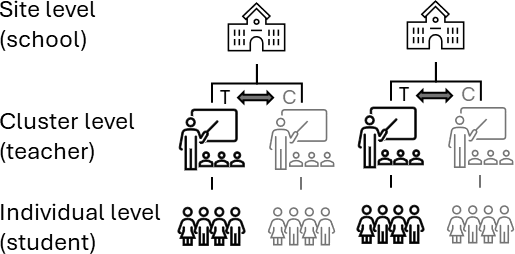

::: {.callout-tip title="How to use this document"}
This page contains the code from the handbook chapter with the explanatory text removed. Run the chunks in order from the top, because later chunks depend on objects created earlier. The numbered notes under a chunk explain the marked lines. The full discussion of each stage is in the handbook chapter.
:::
::: {.callout-note title="The data and the treatment indicator"}
- **Data.** `data/timss_df.rds`, the TIMSS 2015 Grade 4 mathematics assessment for Canada. Students (`student_id`) are nested in teachers (`teacher_id`), who are nested in schools (`school_id`).
- **Treatment indicator.** `multisite_cluster_treatment`, a 0/1 column at the teacher level. It equals 1 when the student's teacher majored in mathematics. Every student of a teacher shares the teacher's value, and treatment varies among the teachers within a school.
- **Clusters and sites.** Teachers (`teacher_id`) are the clusters, and schools (`school_id`) are the sites.
- **Outcome.** `math_score`, the TIMSS mathematics score.

The indicator was constructed from observed covariates to illustrate the design. It is not a real intervention. `data/README.md` describes every variable.
:::

```{r}
#| label: setup
#| message: false
#| warning: false

# ── Packages ──────────────────────────────────────────────────────────────────
library(tidyverse)
library(MatchIt)
library(CMatching)        # within-site / preferential within-site cluster matching
library(cobalt)
library(lme4)
library(marginaleffects)
library(gt)

# CMatching (via Matching) attaches MASS, whose select() masks dplyr::select(); restore dplyr's.
select <- dplyr::select

# ── AIR brand palette ─────────────────────────────────────────────────────────
air_navy   <- "#00507F"
air_blue   <- "#009DD7"
air_mid    <- "#006E9F"
air_green  <- "#08A94F"
air_gray   <- "#E2E6E8"
air_dark   <- "#1C252D"

# Default ggplot2 theme
theme_set(
  theme_minimal(base_size = 12) +
    theme(
      plot.title = element_text(color = air_navy, face = "bold"),
      panel.grid.minor = element_blank()
    )
)

set.cobalt.options(binary = "std")

# ── Data ──────────────────────────────────────────────────────────────────────
# Loads the TIMSS analytic data. multisite_cluster_treatment is constructed in
# Chapter 4 (= 1 if the student's teacher majored in math) and is
# teacher-constant:
# every student in a teacher's classroom shares one value, and the value varies
# across teachers within a school. We load it directly and do not recompute it.
timss <- readRDS("data/timss_df.rds")
```

::: {.callout-note title="Main takeaways"}
- A **multisite cluster assignment design (MCAD)** is one in which treatment is assigned to whole clusters (teachers) that are themselves nested within sites (schools), and every **individual** (student) in a cluster shares the cluster's condition. 
- The MCAD combines elements of the multisite individual assignment design (MIAD) and the cluster assignment design (CAD).
- MCAD can target four estimands: the **individual-average effect**, the **cluster-average effect**, the **individual-based site-average effect**, and the **cluster-based site-average effect**.
- **Matching, balance, and confounding involve all three levels** (individual, cluster, site). 
:::

```{r}
#| label: fig-mcad-design
#| fig-cap: "Structure of a multisite cluster assignment design. Clusters (teachers) are nested within sites (schools) and assigned to treatment (T) or comparison (C); every individual (student) in a cluster shares the cluster's condition, and treatment varies across clusters within a site."
#| out-width: "55%"
#| fig-align: center


```

## Stage 1: Define estimand and understand data {#sec-mcad-stage1}

### Examining the data context

```{r}
#| message: false
#| warning: false
#| code-line-numbers: true

teacher_df <- timss |>
  summarise(across(c(school_id, multisite_cluster_treatment,     # <1>
                     teacher_sex, teacher_age, teacher_years_taught,
                     teacher_edu, teacher_job_satisfaction,
                     school_locale, school_pop, school_econ_pct,
                     school_shortage, school_discipline),
                   first),
            .by = teacher_id) |>
  arrange(teacher_id)

site_diagnostics <- teacher_df |>
  summarise(
    n_teachers = n(),                                            # <2>
    n_treated  = sum(multisite_cluster_treatment == 1),
    n_control  = sum(multisite_cluster_treatment == 0),
    prop_treated = mean(multisite_cluster_treatment == 1),
    .by = school_id
  )

overall_rate <- mean(teacher_df$multisite_cluster_treatment)     # <3>
prop_schools_with_both <- mean(site_diagnostics$n_treated > 0 &
                               site_diagnostics$n_control > 0)
c(overall_rate = overall_rate,
  prop_schools_with_both = prop_schools_with_both)
```

1. `summarise(across(..., first))` collapses to exactly one row per teacher, taking each teacher's value of the (teacher-constant) treatment indicator and the teacher- and school-level covariates.
2. For each school we count its teachers and how many are treated versus comparison. The `prop_treated` column feeds Diagnostic 2.
3. `overall_rate` is the treated share of teachers across the full sample, and `prop_schools_with_both` is the share of schools that contain both a treated and a comparison teacher, the schools in which within-site cluster matching is possible (Diagnostic 1). This share informs the matching choices in Stage 3.

```{r}

icc_3level <- function(var) {
  fit <- lmer(reformulate("(1 | school_id) + (1 | school_id:teacher_id)",
                          response = var), data = timss)
  vc  <- as.data.frame(VarCorr(fit))
  total <- sum(vc$vcov)
  c(school  = vc$vcov[vc$grp == "school_id"] / total,
    teacher = vc$vcov[vc$grp == "school_id:teacher_id"] / total)
}
icc_math <- icc_3level("math_score")
```

```{r}
#| message: false
#| warning: false
#| label: tbl-mcad-treated-counts
#| tbl-cap: "Schools by number of treated teachers (those who majored in math)."
#| code-line-numbers: true

site_diagnostics |>
  count(n_treated, name = "n_schools") |>                       # <1>
  gt() |>
  cols_label(n_treated = "Treated teachers in school",
             n_schools = "Number of schools")                   # <2>
```

1. We count schools by their number of treated teachers, one row per count.
2. The row at zero shows the schools with no treated teacher, which cannot contribute a within-site cluster pair (Diagnostic 1). Most schools with a treated teacher hold exactly one, so within-site pools are thin.

```{r}
#| message: false
#| warning: false
#| code-line-numbers: true

overlap_schools <- site_diagnostics |>                              # <1>
  filter(n_treated > 0 & n_control > 0) |>
  pull(school_id)

teacher_df_overlap <- teacher_df |>                             # <2>
  filter(school_id %in% overlap_schools)

df_overlap <- timss |>                                          # <3>
  filter(school_id %in% overlap_schools)

c(schools_all = n_distinct(timss$school_id),
  schools_with_overlap = length(overlap_schools))
```

1. `overlap_schools` is the set of schools with at least one treated and one comparison teacher, the only schools in which a within-site cluster pair can be formed.
2. `teacher_df_overlap` is the teacher-level frame restricted to overlap schools, the frame the propensity score and cluster matching operate on.
3. `df_overlap` is the corresponding student-level frame, used later to merge teacher match weights back to students for individual-level balance and the outcome model.

## Stage 2: Define distance measure {#sec-mcad-stage2}

### Covariates and aggregation to the cluster level

```{r}
#| message: false
#| warning: false
#| code-line-numbers: true

comp <- timss |>
  summarise(mean_math_conf = mean(student_math_conf),           # <1>
            mean_like_math = mean(student_like_math),
            .by = teacher_id)

teacher_df_overlap <- teacher_df_overlap |>
  left_join(comp, by = "teacher_id")                            # <2>

ps_formula <- multisite_cluster_treatment ~                     # <3>
  teacher_sex + teacher_age + teacher_years_taught +
  teacher_edu + teacher_job_satisfaction +
  school_locale + school_pop + school_econ_pct +
  school_shortage + school_discipline +
  mean_math_conf + mean_like_math
```

1. We aggregate two student covariates to the teacher level (classroom means), the aggregation step described above. Adding SDs or quantiles (not shown) would retain within-class distributional information at the cost of more parameters.
2. The aggregates are merged onto the teacher frame, so every covariate on the propensity score right-hand side is now teacher-constant.
3. `ps_formula` mixes teacher covariates, school covariates, and the classroom aggregates. The left-hand side is the teacher-level treatment indicator. We reuse this formula across the propensity score fits below.

### Estimating the cluster-level propensity score

```{r}
#| message: false
#| warning: false
#| code-line-numbers: true

# Single-level logistic on teacher and school covariates
m_ps_single <- matchit(ps_formula, data = teacher_df_overlap,   # <1>
                       method = NULL, distance = "logit")

# School fixed effects replace the observed school covariates
# (fit shown to illustrate the specification; not stored as a distance)
ps_fe <- glm(update(ps_formula, . ~ . - school_locale -        # <2>
                      school_pop - school_econ_pct -
                      school_shortage - school_discipline +
                      factor(school_id)),
             data = teacher_df_overlap, family = binomial())

# School random intercepts
ps_ri <- glmer(update(ps_formula, . ~ . + (1 | school_id)),    # <3>
               data = teacher_df_overlap, family = binomial())

teacher_df_overlap <- teacher_df_overlap |>
  mutate(pscore_single = m_ps_single$distance,                 # <4>
         pscore_ri     = predict(ps_ri, type = "response"))

summary(teacher_df_overlap$pscore_single)
summary(teacher_df_overlap$pscore_ri)
```

1. Single-level logistic regression, fit with `matchit(..., method = NULL, distance = "logit")` as in Chapters 5 and 6, addresses school confounding only through the observed school covariates.
2. School fixed effects (`factor(school_id)` replacing the observed school covariates) absorb observed *and* unobserved school confounding of teacher selection (Chapter 3). With only three or four teachers per school, however, this model can be fragile, and a fully interacted variant is rarely feasible.
3. School random intercepts model the school effects as draws from a common normal distribution and remain feasible when schools have too few teachers for fixed effects. Here the fitted between-school variance is essentially zero (a singular fit, whose warnings we suppress), so `pscore_ri` nearly duplicates `pscore_single`.
4. We store the single-level and random-intercept propensity score vectors on the teacher frame. (The fixed-effects propensity score is not stored as a matching distance because, with the school absorbed, the appropriate follow-up is exact within-site matching, below.) Each `pscore_*` vector is ready to pass as a `distance` to `matchit()`.

### Checking common support {#sec-mcad-stage2-overlap}

::: panel-tabset

#### Single-level propensity score

```{r}
#| message: false
#| warning: false
#| fig-height: 3.5
#| fig-width: 7
#| label: fig-mcad-ps-overlap
#| fig-cap: "Common support for the teacher-level propensity score."
#| fig-subcap:
#|   - "Density of the teacher propensity score by treatment status."
#|   - "One jittered point per teacher, the more legible view at small teacher counts."
#| layout-nrow: 2
#| code-line-numbers: true

ov <- teacher_df_overlap |>                                     # <1>
  mutate(group = if_else(multisite_cluster_treatment == 1,
                         "Treated", "Comparison"))

bal.plot(m_ps_single,                                           # <2>
         var.name = "distance",
         which = "unadjusted",
         sample.names = "Full sample",
         colors = c(air_navy, air_blue)) +
  scale_fill_manual(values = c(air_navy, air_blue),
                    labels = c("Comparison", "Treated")) +
  labs(x = "Teacher propensity score", fill = "Group") +
  ggtitle("Teacher propensity score density (single-level)")

ggplot(ov, aes(x = pscore_single, y = group, color = group)) +  # <3>
  geom_jitter(height = 0.15, width = 0, size = 2, alpha = 0.7) +
  scale_color_manual(values = c(air_navy, air_blue)) +
  labs(x = "Teacher propensity score", y = NULL) +
  theme(legend.position = "none") +
  ggtitle("Teacher propensity score by teacher (jittered)")
```

1. We label each teacher by treatment status on the overlap teacher frame.
2. The density panel plots the smoothed teacher propensity score by treatment status, drawn with `cobalt::bal.plot()` from the Stage 2 `matchit` object, as in Chapters 5 and 6. Adequate overlap shows the two densities covering the same range.
3. The dot plot places one point per teacher on the propensity score axis, jittered vertically only. It shows each teacher individually rather than smoothing them into a density that is unstable at small counts.

#### Random-intercept propensity score

```{r}
#| message: false
#| warning: false
#| fig-height: 3.5
#| fig-width: 7
#| label: fig-mcad-ps-overlap-ri
#| fig-cap: "Density of the random-intercept teacher propensity score by treatment status."

ggplot(ov, aes(x = pscore_ri, fill = group)) +
  geom_density(alpha = 0.5) +
  scale_fill_manual(values = c(air_navy, air_blue)) +
  labs(x = "Teacher propensity score", y = "Density", fill = NULL) +
  ggtitle("Teacher propensity score density (random intercepts)")
```

:::

## Stage 3: Implement matching method {#sec-mcad-stage3}

### Global (between-site) cluster matching

```{r}
#| message: false
#| warning: false
#| code-line-numbers: true

m_across <- matchit(ps_formula, data = teacher_df_overlap,     # <1>
                    method = "nearest",
                    distance = teacher_df_overlap$pscore_single,  # <2>
                    replace = FALSE, estimand = "ATT")            # <3>

m_across
```

1. `matchit()` runs on the teacher frame. The formula declares which covariates appear in the later balance diagnostics, and `method = "nearest"` requests 1:1 nearest-neighbor matching. With no `exact` constraint, each treated teacher is matched to its nearest comparison teacher anywhere in the overlap sample.
2. `distance =` passes the stored single-level teacher propensity score from Stage 2. Swap in `pscore_ri` to match on the random-intercept propensity score instead.
3. `replace = FALSE` uses each comparison teacher at most once, and `estimand = "ATT"` targets the average effect on the treated teachers, the matching-side counterpart of the worked-example estimand. The three remaining matching approaches keep these settings.

### Within-site cluster matching

```{r}
#| message: false
#| warning: false
#| code-line-numbers: true

m_within_it <- matchit(ps_formula, data = teacher_df_overlap,
                       method = "nearest",
                       distance = teacher_df_overlap$pscore_single,
                       exact = ~school_id,                     # <1>
                       replace = FALSE, estimand = "ATT")

m_within_it
```

1. `exact = ~school_id` restricts every match to the same school, which is the within-site cluster match. `method`, `distance`, `replace`, and `estimand` have the same meanings as in the global block above. We carry `m_within_it` forward to the Stage 4 balance plots, which read `matchit` objects directly.

### Partially-pooled (within-group) cluster matching

```{r}
#| message: false
#| warning: false
#| code-line-numbers: true

m_grouped <- matchit(ps_formula, data = teacher_df_overlap,    # <1>
                     method = "nearest",
                     distance = teacher_df_overlap$pscore_single,
                     exact = ~school_locale,                   # <2>
                     replace = FALSE, estimand = "ATT")

m_grouped
```

1. The call is the within-site `matchit` from above with the exact constraint relaxed from the school identifier to a school-group variable.
2. `exact = ~school_locale` requires matches to share a locale category (rural through urban) rather than the exact school, so a treated teacher can match a comparison teacher in a *different* school of the same locale. In an MCAD this is often the practical default, because within-site pools are small.

### Preferential within-site cluster matching

```{r}
#| message: false
#| warning: false
#| code-line-numbers: true

set.seed(20250601)

td_sorted <- teacher_df_overlap |> arrange(school_id)          # <1>

m_pref <- MatchPW(
  Y     = rep(0, nrow(td_sorted)),                             # <2>
  Tr    = td_sorted$multisite_cluster_treatment,
  X     = td_sorted$pscore_single,
  Group = td_sorted$school_id,
  estimand = "ATT", M = 1, replace = FALSE
)

pref_within <- td_sorted$school_id[m_pref$index.treated] ==    # <3>
  td_sorted$school_id[m_pref$index.control]
n_pref_within   <- n_distinct(m_pref$index.treated[pref_within])
n_pref_fallback <- n_distinct(m_pref$index.treated[!pref_within])

tibble(matched_within_site  = n_pref_within,                   # <4>
       matched_via_fallback = n_pref_fallback,
       dropped              = m_pref$ndrops.matches)
```

1. `MatchPW()` (from `CMatching`, the package Chapter 5 used for site-restricted matching) requires its input vectors sorted in ascending order of `Group`, so we sort the teacher frame by `school_id`.
2. `Y` is not used to choose matches, so we pass a placeholder. `MatchPW()` matches within school first, then searches across schools for any unmatched treated teacher. `M = 1` and `replace = FALSE` request 1:1 matching without reuse in the within-site step; the fallback step itself matches *with* replacement, and here its `r n_pref_fallback` pairs draw on `r n_distinct(m_pref$index.control[!pref_within])` distinct comparison teachers.
3. We classify each matched pair by whether its two teachers share a school. Every treated teacher has a within-school comparison available, yet under `CMatching`'s default 0.25-SD caliper only `r n_pref_within` of the `r n_pref_within + n_pref_fallback` matched within their own school, `r n_pref_fallback` fell back between sites, and `r m_pref$ndrops.matches` were dropped. Report this split whenever the fallback is used.
4. The tibble reports the within-site pairs, the fallback pairs, and the dropped treated teachers.

## Stage 4: Assess quality of the matched sample {#sec-mcad-stage4}

### Sample retention at three levels

```{r}
#| message: false
#| warning: false
#| label: tbl-mcad-retention
#| tbl-cap: "Treated-teacher, site, and student retention by matching approach."
#| code-line-numbers: true

n_treated_teachers <- sum(teacher_df_overlap$multisite_cluster_treatment == 1)

matched_teachers <- bind_rows(                                 # <1>
  "Global"           = match.data(m_across),
  "Within-site"      = match.data(m_within_it),
  "Partially-pooled" = match.data(m_grouped),
  .id = "approach") |>
  filter(multisite_cluster_treatment == 1)

treated_students <- df_overlap |>                              # <2>
  filter(multisite_cluster_treatment == 1)

retention <- matched_teachers |>                               # <3>
  summarise(
    teachers = n(),
    schools  = n_distinct(school_id),
    students = sum(treated_students$teacher_id %in% teacher_id),
    .by = approach
  ) |>
  mutate(pct_treated = 100 * teachers / n_treated_teachers)

retention |>
  gt() |>
  cols_label(approach = "Matching approach", teachers = "Treated teachers",
             schools = "Schools", students = "Treated students",
             pct_treated = "% teachers retained") |>
  fmt_number(columns = pct_treated, decimals = 1)
```

1. `bind_rows(..., .id = "approach")` stacks the three MatchIt-based matched samples into one frame labeled by approach, mirroring the retention pattern in Chapter 6, and we keep the treated teachers.
2. This filters to the treated students in the overlap sample. Each approach's student count is the number of these students whose teacher is in that approach's matched sample.
3. One `summarise()` per approach counts the three retention levels before we add the percentage of the `r n_treated_teachers` treated teachers retained. An approach that keeps few treated clusters describes a different population than one that keeps most of them.

### Cluster covariate balance (SMD & variance ratio) {#sec-mcad-stage4-cluster}

```{r}
#| message: false
#| warning: false

var_labels <- c(
  distance                = "Propensity score",
  school_id               = "School",
  teacher_sex             = "Teacher sex",
  teacher_age             = "Teacher age",
  teacher_years_taught    = "Years taught",
  teacher_edu             = "Teacher education",
  teacher_job_satisfaction = "Job satisfaction",
  school_locale           = "School locale",
  school_pop              = "Community population",
  school_econ_pct         = "Economically disadvantaged %",
  school_shortage         = "Resource shortage scale",
  school_discipline       = "Discipline/climate index",
  mean_math_conf          = "Class mean math confidence",
  mean_like_math          = "Class mean liking math",
  student_math_conf       = "Math confidence",
  student_age             = "Age",
  student_like_math       = "Liking math",
  student_sex             = "Sex",
  dad_edu                 = "Father's education",
  mom_edu                 = "Mother's education")
```

::: panel-tabset

#### Global

```{r}
#| message: false
#| warning: false
#| fig-height: 4.5
#| fig-width: 7
#| label: fig-mcad-teacher-balance-across
#| fig-cap: "Teacher-level balance for the global cluster match: standardized mean differences (left) and variance ratios (right), before and after matching."
#| code-line-numbers: true

love.plot(m_across,                                             # <1>
          stats = c("mean.diffs", "variance.ratios"),          # <2>
          thresholds = c(m = .25, v = 2),                      # <3>
          sample.names = c("Overlap sample", "Matched sample"),
          var.names = var_labels,
          colors = c(air_navy, air_blue),
          title = "Teacher-level balance (global)")
```

1. `love.plot()` takes a `matchit` object directly and shows balance on the teacher and school covariates for the full sample and the matched sample. `binary = "std"` is set globally in setup.
2. `stats = c("mean.diffs", "variance.ratios")` produces SMDs on the left and variance ratios on the right. The variance-ratio panel is the addition relative to a means-only check.
3. `thresholds = c(m = .25, v = 2)` draws reference lines at SMD 0.25 and variance ratio 2 (and its reciprocal 0.5). We use the 0.25 default rather than a stricter line and reserve 0.10 for named confounders where a study justifies it. `sample.names` labels the unadjusted (overlap) and matched samples in the legend.

#### Within-site

```{r}
#| message: false
#| warning: false
#| fig-height: 4.5
#| fig-width: 7
#| label: fig-mcad-teacher-balance
#| fig-cap: "Teacher-level balance for the within-site cluster match: standardized mean differences (left) and variance ratios (right), before and after matching."
#| code-line-numbers: true

love.plot(m_within_it,                                          # <1>
          stats = c("mean.diffs", "variance.ratios"),
          thresholds = c(m = .25, v = 2),
          sample.names = c("Overlap sample", "Matched sample"),
          var.names = var_labels,
          colors = c(air_navy, air_blue),
          title = "Teacher-level balance (within-site)")
```

1. Two display rows in this plot need a reader's note. The `School` row is the exact-matching variable, balanced by construction rather than through the propensity score. The `distance` row's large post-match SMD reflects the within-site trade-off, in that restricting matches to the same school leaves the propensity scores themselves less closely paired.

#### Partially-pooled

```{r}
#| message: false
#| warning: false
#| fig-height: 4.5
#| fig-width: 7
#| label: fig-mcad-teacher-balance-grouped
#| fig-cap: "Teacher-level balance for the partially-pooled (within-locale) cluster match: standardized mean differences (left) and variance ratios (right), before and after matching."

love.plot(m_grouped,
          stats = c("mean.diffs", "variance.ratios"),
          thresholds = c(m = .25, v = 2),
          sample.names = c("Overlap sample", "Matched sample"),
          var.names = var_labels,
          colors = c(air_navy, air_blue),
          title = "Teacher-level balance (partially-pooled)")
```

:::

### Comparing balance across approaches

```{r}
#| message: false
#| warning: false
#| label: tbl-mcad-smd-summary
#| tbl-cap: "Post-match teacher-level covariate balance by matching approach."
#| code-line-numbers: true

smd_summary <- function(b) {                                    # <1>
  bal <- b$Balance
  bal <- bal[!(bal$Type == "Distance" |                         # <2>
                 rownames(bal) == "school_id"), , drop = FALSE]
  d <- coalesce(bal$Diff.Adj, bal$Diff.Un)
  v <- coalesce(bal$V.Ratio.Adj, bal$V.Ratio.Un)
  c(max = max(abs(d), na.rm = TRUE), mean = mean(abs(d), na.rm = TRUE),
    vr_min = suppressWarnings(min(v, na.rm = TRUE)),
    vr_max = suppressWarnings(max(v, na.rm = TRUE)))
}

smd_tbl <- list(                                                # <3>
  "Global"           = bal.tab(m_across,     stats = c("mean.diffs", "variance.ratios")),
  "Within-site"      = bal.tab(m_within_it, stats = c("mean.diffs", "variance.ratios")),
  "Partially-pooled" = bal.tab(m_grouped,   stats = c("mean.diffs", "variance.ratios"))
) |>
  map(smd_summary) |>
  bind_rows(.id = "approach")

smd_tbl |>
  gt() |>
  cols_label(approach = "Matching approach", max = "Max |SMD|", mean = "Mean |SMD|",
             vr_min = "Min VR", vr_max = "Max VR") |>
  fmt_number(columns = c(max, mean), decimals = 3) |>
  fmt_number(columns = c(vr_min, vr_max), decimals = 2)
```

1. As in Chapter 6, `smd_summary()` condenses a `cobalt` balance table to the worst and average absolute SMD and the variance-ratio range. `coalesce()` picks the adjusted value when available and the raw value otherwise (`cobalt` leaves the other column entirely `NA`).
2. We drop the propensity-score "distance" row and the raw `school_id` identifier row (present because the within-site match is exact on the school) so the summary reflects covariates only.
3. A named list of the three balance tables mapped through the helper and stacked with `bind_rows(.id =)`, one row per matching approach.

### Within-site cluster balance {#sec-mcad-stage4-within-site}

```{r}
#| message: false
#| warning: false
#| code-line-numbers: true

bal.tab(m_within_it, data = teacher_df_overlap,                # <1>
        cluster = "school_id",
        stats = c("mean.diffs"),
        which.cluster = .none)                                  # <2>
```

1. `bal.tab(..., cluster = "school_id")` computes teacher-level balance separately within each school on the within-site matched sample, testing whether matched teachers resemble each other inside their shared school. With a string cluster variable, `bal.tab` needs an explicit `data` argument, so we pass `data = teacher_df_overlap`.
2. `which.cluster = .none` suppresses the per-school printout and returns the across-cluster summary. Pass specific school ids to inspect individual schools. `stats = c("mean.diffs")` reports SMDs only; per-school variance ratios are not estimable at these cell sizes.

### Individual covariate balance (SMD & variance ratio) {#sec-mcad-stage4-individual}

```{r}
#| message: false
#| warning: false
#| fig-height: 4.5
#| fig-width: 7
#| label: fig-mcad-student-balance
#| fig-cap: "Student-level standardized mean differences and variance ratios after within-site cluster matching. Residual student-level imbalance can persist even when teacher-level balance is good."
#| code-line-numbers: true

student_matched <- match.data(m_within_it) |>                  # <1>
  select(teacher_id, weights, subclass) |>
  inner_join(df_overlap, by = "teacher_id")                    # <2>

stud_bal_df <- df_overlap |>
  left_join(match.data(m_within_it) |> select(teacher_id, weights),
            by = "teacher_id") |>
  mutate(weights = replace_na(weights, 0))                     # <3>

stud_bal <- bal.tab(
  multisite_cluster_treatment ~ student_math_conf +
    student_age + student_like_math + student_sex +
    dad_edu + mom_edu,
  data = stud_bal_df, weights = stud_bal_df$weights,
  un = TRUE,                                                   # <4>
  s.d.denom = "treated",
  stats = c("mean.diffs", "variance.ratios"))

love.plot(stud_bal,                                            # <5>
          stats = c("mean.diffs", "variance.ratios"),
          thresholds = c(m = .25, v = 2),
          sample.names = c("Overlap sample", "Matched sample"),
          var.names = var_labels,
          colors = c(air_navy, air_blue),
          title = "Student-level balance after within-site matching")
```

1. `match.data()` returns the matched teachers with their match `weights` and `subclass`. We keep just the teacher id and these columns. With 1:1 matching without replacement every weight equals 1, so the weight arguments below are inert; we carry them anyway so the code transfers to designs (replacement, 1:M ratio matching) where the weights are non-uniform.
2. `inner_join` to `df_overlap` expands each matched teacher to the students in that teacher's classroom, carrying the teacher's match weight onto every student row. This frame feeds the outcome models in Stage 5.
3. For the balance check we instead keep every overlap student, assigning weight 0 to students whose teacher went unmatched, so the unadjusted comparison reflects the full overlap pool while the weights define the matched sample. The formula lists student covariates only (the teacher covariates were the Stage 4 teacher-level target).
4. `un = TRUE` stores the unadjusted statistics alongside the weighted ones, so the love plot displays balance before and after matching. `s.d.denom = "treated"` standardizes each difference by the treated-group standard deviation, the convention when the estimand targets the treated group.
5. In this sample no student covariate exceeds 0.25 after matching, so classroom composition raises no additional concern. When this check does flag covariates, they represent within-classroom compositional differences that aggregation to the teacher level misses.

### Site covariate balance (SMD & variance ratio)

```{r}
#| message: false
#| warning: false
#| code-line-numbers: true

bal.tab(m_across, stats = c("mean.diffs", "variance.ratios"))  # <1>
```

1. We compute school-level balance on the global matched teacher frame, where school covariates were *not* held constant by construction. The school covariates appear in the table because they are part of the `matchit` formula, and their rows show the global approach's residual school imbalance, the cost of trading site control for a larger pool.

## Stage 5: Analyze outcomes {#sec-mcad-stage5}

### Estimating the individual-average effect

#### Three-level model

```{r}
#| message: false
#| warning: false
#| code-line-numbers: true

three_level_outcome <- lmer(
  math_score ~ multisite_cluster_treatment +                   # <1>
    student_math_conf + student_age + student_like_math +
    student_sex + dad_edu + mom_edu +
    teacher_sex + teacher_age + teacher_years_taught +
    teacher_edu + teacher_job_satisfaction +
    school_econ_pct + school_discipline +
    (1 | school_id) + (1 | school_id:teacher_id),              # <2>
  data = student_matched, weights = weights,
  control = lmerControl(optimizer = "bobyqa"))

att_three_level <- avg_comparisons(three_level_outcome,          # <3>
                                   variables = "multisite_cluster_treatment")
att_three_level |> select(estimate, std.error, conf.low, conf.high)
```

1. The fixed part includes the teacher-level treatment plus pretreatment covariates at all three levels, which makes the estimator doubly-robust.
2. `(1 | school_id) + (1 | school_id:teacher_id)` are the school and teacher random intercepts. There is no random treatment slope, because treatment does not vary within a teacher.
3. G-computation on the three-level fit returns the treatment effect under this specification. With no treatment interaction it equals the model's fixed-effect coefficient, a precision-weighted average across the multilevel variance structure.

#### Two-level model with school fixed effects

```{r}
#| message: false
#| warning: false
#| code-line-numbers: true

fe_outcome <- lm(
  math_score ~ multisite_cluster_treatment +                   # <1>
    student_math_conf + student_age + student_like_math +
    student_sex + dad_edu + mom_edu +
    teacher_sex + teacher_age + teacher_years_taught +
    teacher_edu + teacher_job_satisfaction + factor(school_id), # <2>
  data = student_matched, weights = weights)
```

1. The fixed part includes the same student- and teacher-level covariates as the three-level model, with school variation absorbed by the fixed effects, keeping the two estimates comparable.
2. `factor(school_id)` absorbs all between-school variation with fixed intercepts, which mirrors the within-site matched design.

```{r}
#| message: false
#| warning: false
#| code-line-numbers: true

att_mcad <- avg_comparisons(
  fe_outcome,
  variables = "multisite_cluster_treatment",                   # <1>
  newdata = filter(student_matched,
                   multisite_cluster_treatment == 1),
  vcov = ~school_id,                                           # <2>
  wts = "weights")

att_mcad |> select(estimate, std.error, conf.low, conf.high)
```

1. `variables = "multisite_cluster_treatment"` is the contrast: `avg_comparisons()` switches each student's teacher from comparison to treated and averages the predicted difference, which is g-computation (Chapter 3). `newdata = filter(..., multisite_cluster_treatment == 1)` restricts the average to the treated students, and `wts = "weights"` applies the match weights. In this additive model neither changes the number; with interactions they are what separate the effect on the treated from a whole-sample average.
2. `vcov = ~school_id` clusters the standard errors on the school, the highest level, because dependence propagates through students, teachers, and schools. The two-way clustering recommended in Chapter 5 reduces to school-only clustering when pairs are nested in schools, as they are here.

### Estimating the cluster-average effect

```{r}
#| message: false
#| warning: false
#| code-line-numbers: true

teacher_outcomes <- student_matched |>
  summarise(
    multisite_cluster_treatment = first(multisite_cluster_treatment),  # <1>
    mean_math      = mean(math_score),
    mean_math_conf = mean(student_math_conf),
    mean_dad_edu   = mean(dad_edu),
    teacher_sex    = first(teacher_sex),
    teacher_age    = first(teacher_age),
    teacher_years_taught = first(teacher_years_taught),
    teacher_edu    = first(teacher_edu),
    teacher_job_satisfaction = first(teacher_job_satisfaction),
    school_id      = first(school_id),
    wt = first(weights),
    .by = teacher_id)

fit_teacher_agg <- lm(                                             # <2>
  mean_math ~ multisite_cluster_treatment + teacher_sex +
    teacher_age + teacher_years_taught + teacher_edu +
    teacher_job_satisfaction + mean_math_conf + mean_dad_edu +
    factor(school_id),
  data = teacher_outcomes, weights = wt)

att_teacher_agg <- avg_comparisons(fit_teacher_agg,              # <3>
                                   variables = "multisite_cluster_treatment")
att_teacher_agg |> select(estimate, std.error, conf.low, conf.high)
```

1. This aggregates the matched students to one row per teacher: the teacher-mean outcome, the teacher-constant treatment and school, teacher covariates, and two classroom-mean student aggregates for the doubly-robust adjustment.
2. An ordinary regression on the teacher-level frame with school fixed effects, weighted by each teacher's match weight. The fixed effects make this a within-site MIAD analysis of teachers, matching the within-site design and absorbing the (now collinear) school covariates.
3. With one row per teacher, every teacher counts equally, so g-computation targets the cluster-average effect; in this additive model the unrestricted average equals the effect on the treated clusters. The standard error treats teachers as independent given the school fixed intercepts, and with `r nrow(teacher_outcomes)` rows against `r length(coef(fit_teacher_agg))` coefficients the fit is thin, so read the estimate as illustrative.

### Examining between-site heterogeneity

```{r}
#| message: false
#| warning: false
#| code-line-numbers: true

het_model <- lmer(                                             # <1>
  math_score ~ multisite_cluster_treatment +
    student_math_conf + student_age + student_like_math +
    student_sex + dad_edu + mom_edu +
    (1 | school_id) +
    (1 | school_id:teacher_id) +                              # <2>
    (0 + multisite_cluster_treatment | school_id),            # <3>
  data = student_matched, weights = weights,
  control = lmerControl(optimizer = "bobyqa"))

VarCorr(het_model)                                            # <4>
```

1. `het_model` includes a school random intercept, a teacher random intercept, and a school-level random treatment slope over the teacher-level treatment, with the school-specific effects treated as draws from a common normal distribution.
2. `(1 | school_id:teacher_id)` is the teacher random intercept, matching the Stage 5 three-level model. Without it, ordinary between-teacher outcome variation would load onto the school-level treatment slope, because the treatment is teacher-constant.
3. `(0 + multisite_cluster_treatment | school_id)` is the school-level random treatment slope, how much the (teacher-level) treatment effect varies across schools. It includes no `1 +`, so the intercept is supplied separately by `(1 | school_id)`.
4. `VarCorr()` reports the estimated standard deviations of the random effects. The treatment-slope standard deviation is the between-school variation in the treatment effect.

```{r}
vc <- as.data.frame(VarCorr(het_model))
tau_het <- vc$sdcor[which(vc$var1 == "multisite_cluster_treatment" & is.na(vc$var2))]
sd_teacher_het <- vc$sdcor[grepl("teacher_id", vc$grp) & vc$var1 == "(Intercept)"]
n_single_treated <- student_matched |>
  distinct(school_id, teacher_id, multisite_cluster_treatment) |>
  filter(multisite_cluster_treatment == 1) |>
  count(school_id) |>
  filter(n == 1) |>
  nrow()
n_matched_schools <- n_distinct(student_matched$school_id)
```
