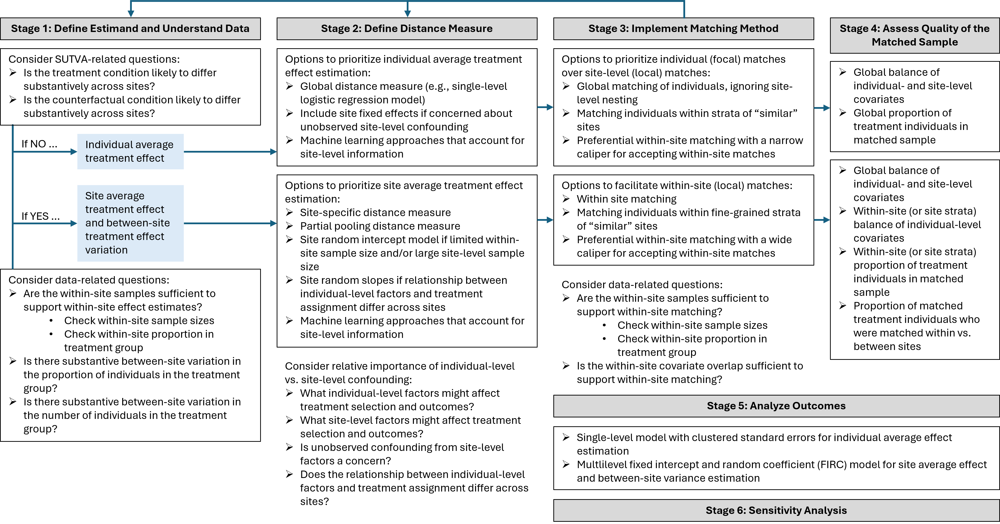
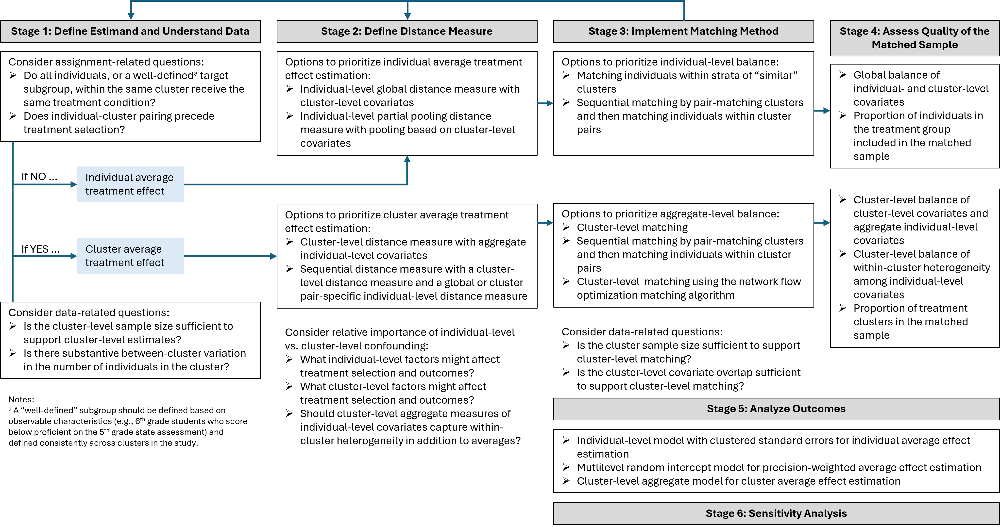

The two flowcharts summarize the guiding questions and options at each stage for the two designs covered in the hands-on session. They are Figures 3.2 and 3.3 of the handbook, where Chapter 3 discusses each decision. Guidance for the multisite cluster assignment design combines the two.

Use them in the exercise block: find your design, walk the questions for your study, and note which option you land on at each stage. Each option corresponds to a block of code on the Chapter 5, 6, or 7 page.

## Multisite individual assignment design (MIAD)

{width=100%}

## Cluster assignment design (CAD)

{width=100%}
