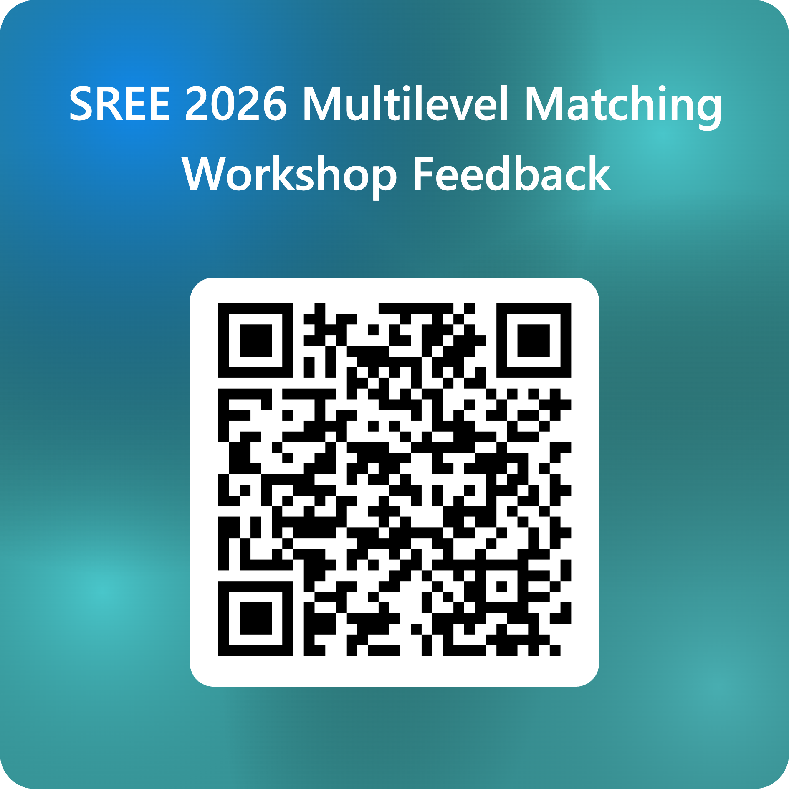

**SREE 2026 workshop** · Baltimore · Wednesday, September 23, 2026 · Laurel AB, 9:30 a.m. · 2 hours

**Instructors:** Jordan Rickles (UCLA) and Alberto Guzman-Alvarez (American Institutes for Research)

This site holds the hands-on materials for the workshop. Each chapter page contains the R code from one chapter of the handbook *Propensity Score Matching in Multilevel Educational Settings*. The explanatory text has been removed so that the code can be run from top to bottom. Chapter 4, which covers the data and the package setup, is shown from the handbook during the workshop.

## How the session runs

Jordan opens with the lecture, which covers the foundational concepts, the typology of multilevel designs, and the six-stage matching workflow. Alberto then introduces the data and the packages using Chapter 4 of the handbook. After a ten-minute break, we work through the Chapter 5 page together and then the Chapter 6 page, stopping for questions at the end of every stage. The last few minutes are for questions.

## Slides

The lecture slides for the first hour are available as a [PDF](slides/MMT_SREE_2026Conference_WorkshopSlides.pdf). They cover the foundational concepts, the typology of multilevel designs, the six-stage matching workflow, and an overview of the practice guide.

## Before the workshop

Install R and either RStudio or Positron, download this repository, run the install script, and then run the setup check. The [Before you come](before_you_come.qmd) page has the full list of what to bring and what to install.

## The pages

| Page | Handbook chapter | Contents |
|---|---|---|
| [MIAD](05_miad.qmd) | 5 | The multisite individual assignment design, in which students are assigned to treatment within schools. The page covers eight propensity scores across seven chunks, four matching approaches, balance both pooled and within site, individual-average and site-average effects, the FIRC model, and a sensitivity analysis. We run this page together in the room. It ends with a "Try it" block and a template for your own data, both of which are yours to take home. |
| [Decision flowcharts](flowcharts.qmd) | 3 | The guiding questions and the options at each stage for the MIAD and the CAD, for use with your own study. |
| [CAD](06_cad.qmd) | 6 | The cluster assignment design, in which whole schools are assigned to treatment. The page covers the cluster-level propensity score, cluster-global, sequential, and network-flow matching, balance at two levels, cluster-average and individual-average effects, permutation inference, and a sensitivity analysis. We run this page together as well, after Chapter 5. |
| [MCAD](07_mcad.qmd) | 7 | The multisite cluster assignment design, in which teachers are assigned to treatment within schools and students are nested in teachers. This design combines the other two. The page is included for reference and is not covered in the session. |

Each page follows the same six stages. First, define the estimand. Second, define the distance measure. Third, implement the matching method. Fourth, assess the matched sample. Fifth, analyze the outcomes. Sixth, run a sensitivity analysis.

## The data

All examples use `data/timss_df.rds`, which contains the TIMSS 2015 Grade 4 mathematics data for Canada, with 2,478 students nested in teachers, who are nested in schools. The three treatment indicators were constructed from observed covariates to illustrate the three designs. They are not real interventions, and the estimates on these pages illustrate the workflow rather than report findings. See `data/README.md` for the variable list and the caveats.

## Using the code with your own data

The chunks are written so that the dataset, the treatment indicator, the site identifier, and the covariate formulas are set near the top of each stage. Replace those objects with your own to run the workflow on your study. Your data should have one row per individual, with a 0/1 treatment column, a site or cluster identifier, the covariates, and the outcome. The "Your own data" block at the end of the Chapter 5 page lists the five objects to change.

## Feedback and testers

Please tell us what worked and what did not, using the form at <https://forms.cloud.microsoft/r/XZpKK1aEmY>. The form also asks whether you would like to be an end-user tester for the handbook before it is finalized.

{width=40% fig-align="left"}
